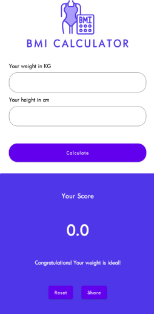

# CALCULADORA IMC

  
|                    MOBILE                  |
| :----------------------------------------- | 
|  |

 
  
-  [TO DO LIST](#to-do-list)
-  [TECNOLOGIAS APLICADAS](#tecnologias-aplicadas)
-  [FERRAMENTAS](#ferramentas)
-  [CONCEITOS APLICADOS](#conceitos-aplicados)
-  [COLABORADORES](#colaboradores)
   

   <h1>SOBRE</h1>   

Esse projeto foi proposto pelo professor de Desenvolvimento Mobile (KOTLIN) com
objetivo de desenvolvermos um aplicativo de calculo de IMC.

   <h1>TO DO LIST:</h1>   

- [x] Desenvolver um aplicativo de calculo de IMC
- [x] Implementar o JETPACK COMPOSE

  
   <h1>TECNOLOGIAS APLICADAS</h1>   

- KOTLIN

<h1>FERRAMENTAS</h1> 
       

   <h1>CONCEITOS APLICADOS</h1>   

- JETPACKCOMPOSE

   <h1>COLABORADORES</h1>   

  
  | NOMES                                                                                                                                                                                      |                                               GITHUB                                               |                                       FOTO                                        |
| :----------------------------------------------------------------------------------------------------------------------------------------------------------------------------------------- | :------------------------------------------------------------------------------------------------: | :-------------------------------------------------------------------------------: |
|  |  | </a>  |
